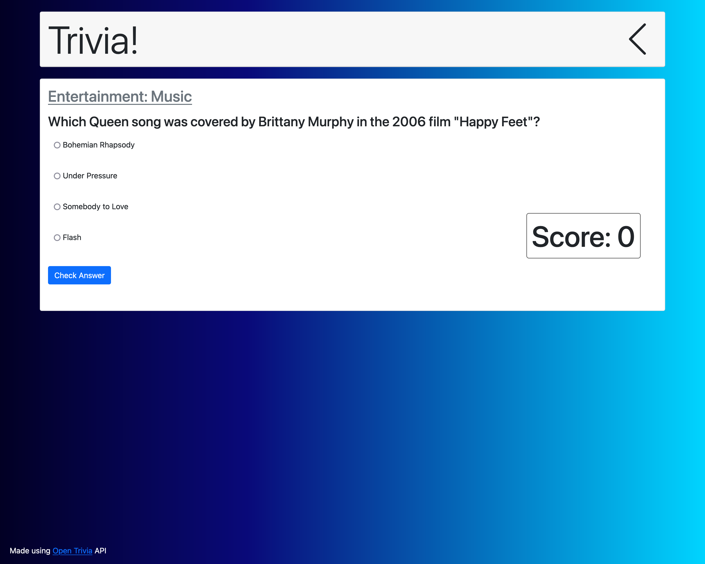

# quiz-game

## About

This was the first full application I made using a 3rd party API. The application is styled with bootstrap and I used Axios to fetch data from the Open Trivia API.

This is an older project but I am just getting it up to github now for more git and github practice.

## Challenges

I had issues getting animations to work while using Bootstrap. However I was able to find the answers in the documentation from Bootstrap on [Collapse](https://getbootstrap.com/docs/4.0/components/collapse/).
